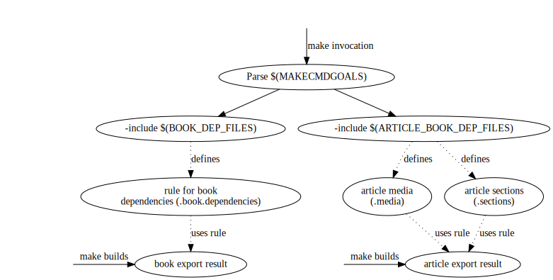

How Dependencies are Generated
------------------------------

As shown in the [dependency structure section](../make_overview.md), the final result depends on some dynamically generated makefiles, which define intermediate targets with the dependencies needed. 

While this is accurate in terms of a dependency model, it is not how `make` builds an export target! Instead, we split the build in two phases:

1. Parse `$(MAKECMDGOALS)` and generate a list of all dependency files which need to be generated. These are `$(BOOK_DEP_FILES)` for books, (`book.mk`) and `$(ARTICLE_BOOK_DEP_FILES)` for articles (`article_book.mk`). They contain a list of `.book.dep` or `.section-dep` and `.media-dep` files, respectively. \
This list is then included with `-include`, which will tell GNU Make to immediately try to build them. So `make` goes ahead and builds the sitemap and dependency files, without working on the actual target, yet. \
This is why some errors, like `no rule to make target` if a wrong target path is given, may only occur after the dependency files have already been built.
2. After the dependency files have been built, make includes them and only now considers makefile loading complete.\
It will now proceed to build the actual target file, using the rules and dependency information generated in the previous phase.

