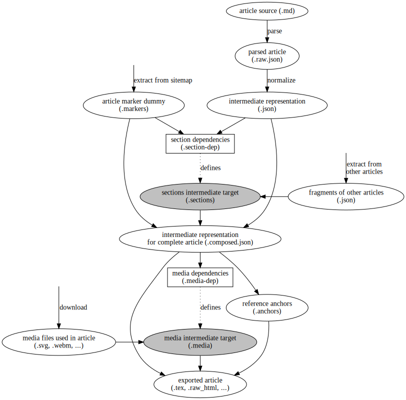

Export Dependency Structure
===========================

To understand the process of exporting articles of books, we must first understand which inputs the final output depends on. We will use the follwing notation for dependency graphs:

* ellipses with white background represent a file
* ellipses with with gray background represent an *intermediate target*, which is not created as a file but is used to *group dependencies* together (as the prerequisites of this target)
* text-filled rectangles represent makefiles. These usually add dynamically generated dependencies. (see [Makefile Patterns](./make_patterns.md))
* bigger rectangles group a set of files / targets with *common prerequisites*. An edge (arrow) pointing at the rectangle border means all files in this cluster / group depend on this file.

Actual filenames always have their article or book revision id before their file extension

Article Dependencies
--------------------

The image blow shows the (simplified) dependency graph for a single article:

Where:

* __article source (`.md`)__: WikiText source code of the article.
* __parsed article (`.raw.json`)__: Raw parser result of the article.
* __intermediate representation (`.json`)__: Post-processed (normalized) abstract syntax tree of the article.
* __article markers (`.markers`)__: Describes the article in the context of a book (see [Concepts](./concepts.md)). When exporting only a single article, this is just a dummy. But for a whole book, some parts of the article could be excluded, which may change which sections or images are included. Thus, the whole subsequent export is dependent on this file. This part is extracted from the sitemap (specifically subtargetmap), with the current subtarget renamed to `current`.
* __section dependencies (`section_dep`)__: A makefile defining the intermediate `.sections` target, which has all sections included in this article as prerequisites.
* __media dependencies (`media_dep`)__: Like `.section_dep`, but for included media files. Since included sections may in turn include new media files, this depends on `.sections`. Defines the intermediate target `.media`.
* __fragments of other articles (`.json`)__: The article fragments included as sections. These, of course depend on the intermediate representation of their origin articles, which is ommited here for clarity. The `.sections`-Target depends on all included sections (article fragments).
* __media files used in the article (`.svg, .png, .webm, ...`)__: All media files the article uses as prerequisites of the `.media` intermediate target.
* __reference anchors (`.anchors`)__: A list of all link targets this article provides. This is used to differentiate between internal and external link targets (e.g. jump to the corresponding page for a present link target, but link to the Website if the target is not included in the export). \
When only a single article is exported, only anchors defined in this article are relevant. If a whole book is exported, this simplification does not hold any more. Then, every article output depends on the list of all anchors defined in the book, which in turn depends on the individual `.anchors`-files of the articles.
* __exported article (`.tex, .raw_html, ...`)__: Export of the article in a target format.
* __target configuration file (`.yml`)__: Last but not least, most of the export steps depend on the main configuration file, which contains the configuration for every export target (aka *subtarget* or *target configuration*).

Book Dependencies
-----------------

Now we know the dependency structure of a single article. But what about a book? In the context of a book, article export is similar, but with some important differences:

* The article markers are no longer empty, but are specified in the sitemap.
* The exported article depends on a book-wide `.anchors` while, which contains the combined reference anchors for the whole book.

As a graph:

Where:

* __sitemap article source (`.md`)__: WikiText source code of the sitemap article.
* __sitemap intermediate representation (`.json`)__: Abstract sytax tree of the sitemap. Until now the sitemap is treated just like any normal article.
* __sitemap (`.sitemap.json`)__: Special sitemap data structure.
* __subtargetmap (`.subtargetmap.json`)__: Sitemap with only the information relevant for the current subtarget. 
* __book dependency file (`.book.dep`)__: A makefile defining the intermediate `.book.dependencies` target, which has all exported articles as prerequisites. 
* __book anchors (`.anchors`)__: A list of all link targets the book provides. It is build from the `.anchors`-files of the individual articles.
* __book export results (`.book.tex, .book.html, ...`)__: The final output of the book export.
